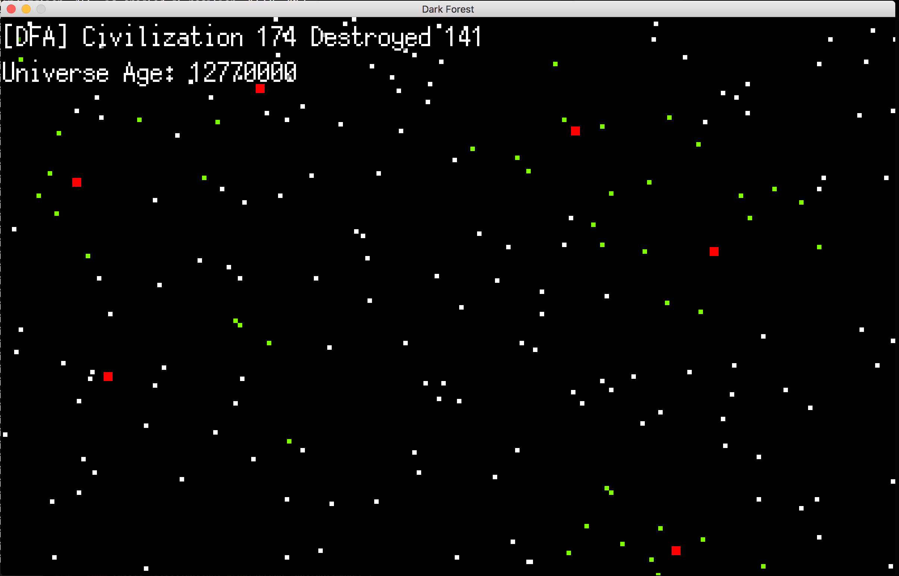

# Dark Forest

This project simulates the Dark Forest model of the Universe as described in the well-known Sci-Fi [The Three-Body-Problem](https://en.wikipedia.org/wiki/The_Three-Body_Problem)

### Background
Go READ the book.
```{go}
if TL;DR { 
	intro1 := "civilizations are like citizens of the dark forest, \\
	and they are hidden from each other. Some of them naively think that all civilizations would be friendly to each other"

	intro2 := "some high-level civilizations already learnt the dark forest model of the universe \\
	so they chose to remain quiet and hideen. But for those who didn't, they either lit up a fire or shouted \\
	greetings hoping to hear back from their 'brothers'"

	intro3 := "however, because of barrier of communication (or chain of suspicion) and technology \\ 
	explosion (this part is something you should definitely read in the book), those who heard the  \\
	voices or saw the fire only had one choice but to destroy the rule breaker in order to keep its own safety"

	return Dark_Forest_Simulator
}
```

### Screenshot

* All Squares -- Civilization
* White Squares -- Hidden Civilization (those who have not revealed their coordinates)
* Red Squares -- Revealed Civilization (who broadcasted their coordinates)
* Green Squares -- Civilization that received the messages of broadcasters (Red ones)

### TODOs
1. haven't used attributes like OwnedMatter etc to determine the relative strength of different civilizations
2. drawing code are kind of mixed up in the models (probably wont fix cuz lazy)
3. didn't fully model chain of suspicion and tech explosion (which were the original ambitious goals)

### Conclusion
Go has a lot of good features, like powerful interface system, built-in concurrency mechanism via goroutines and channels (really helped model all civilizations at the same time). It's perfect for server side programming and command line tools, but it probably isn't a really suitable choice for GUI rendering (or it could be me who's not good at writing efficent GUI rendering code in Go :) ).

